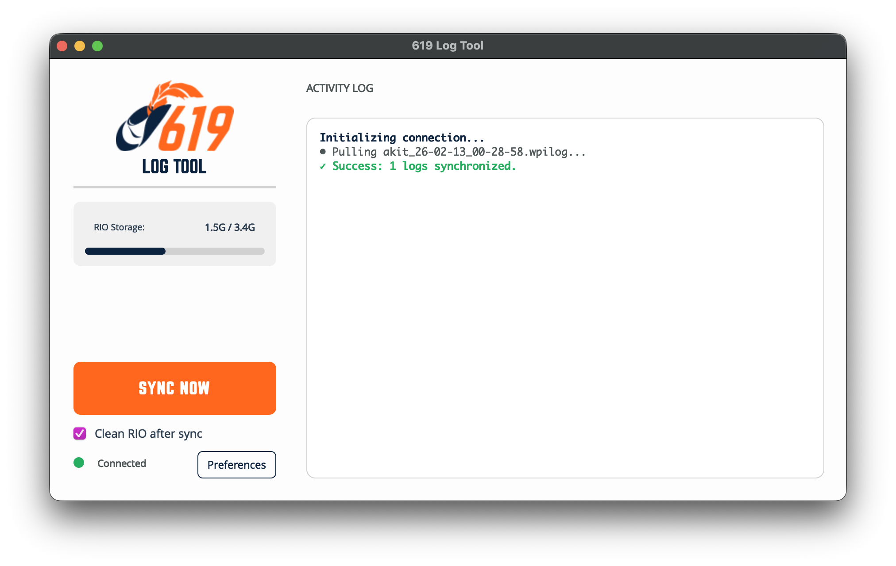

# 619 RIO Log Manager

A lightweight PyQt6 application designed for FRC teams to quickly synchronize and manage logs from a RoboRIO.

## Features
- **Real-time Monitoring:** Tracks RoboRIO disk usage and connection status.
- **Fast Sync:** Pulls logs from \`/home/lvuser/akitlogs\` via SFTP.
- **Auto-Cleanup:** Option to delete logs from the RIO after a successful sync.
- **Dark Mode:** Support for both light and dark UI themes.

## Installation
Download the latest version for your operating system from the [Releases](https://github.com/Ihlathi/RioLogManager/releases) page.

### macOS
1. Download the \`RioLogManager-macOS.zip\`.
2. Extract the application and move it to your \`Applications\` folder (if you would like).
3. When you open it for the first time, MacOS will complain about it not being signed. You can override this at the bottom of System Settings/Privacy & Security. **Open**.

### Windows
1. Download \`RioLogManager-Windows.zip\`.
2. Extract the application and run the executable; no installation required.
2. Windows will complain about the app not being signed—you'll have to override this.

## Usage
Once launched, ensure you are connected to the robot radio or via USB-B. 

### Configuration
Access the **Preferences** menu to set:
- **RoboRIO IP:** Defaults to \`10.6.19.2\`.
- **Save Location:** Local directory where logs will be stored.
- **Dark Mode:** Toggle UI appearance.